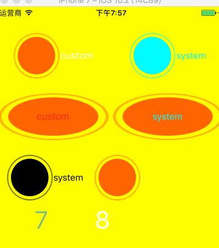

## Button Type使用中可能遇到的问题

#### 代码
```objc
   self.view.backgroundColor = [UIColor yellowColor];
    // code
    // 初始化为system类型
    UIButton *button = [UIButton buttonWithType:UIButtonTypeSystem];
    button.frame =  CGRectMake(0, 240, 160, 80);
    [button setImage:[UIImage imageNamed:@"CameraShot"] forState:UIControlStateNormal];
    [button setTitle:@"system" forState:UIControlStateNormal];
    // 当为system类型时，默认title颜色和image的颜色受tintColor控制
    button.tintColor = [UIColor darkTextColor];
    [self.view addSubview:button];
    
    // 初始化为custom类型
    UIButton *button1 = [UIButton buttonWithType:UIButtonTypeCustom];
    button1.frame =  CGRectMake(160, 240, 80, 80);
    // 当为custom类型时，默认title颜色和image的颜色不受tintColor控制
    button1.tintColor = [UIColor darkTextColor];
    [button1 setImage:[UIImage imageNamed:@"CameraShot"] forState:UIControlStateNormal];
    [button1 setTitle:@"system" forState:UIControlStateNormal];
    [self.view addSubview:button1];
    
    // 初始化为system类型，设置title会有闪烁
    UIButton *timeButton1 = [UIButton buttonWithType:UIButtonTypeSystem];
    timeButton1.frame = CGRectMake(50, 340, 50, 20);
    [timeButton1 setTitle:@"0" forState:UIControlStateNormal];
    timeButton1.titleLabel.font = [UIFont systemFontOfSize:40.0];
    [self.view addSubview:timeButton1];
    
    // 初始化为custom类型，设置title不会有闪烁
    UIButton *timeButton2 = [UIButton buttonWithType:UIButtonTypeCustom];
    timeButton2.frame = CGRectMake(150, 340, 50, 20);
    timeButton2.tintColor = [UIColor darkTextColor];
    [timeButton2 setTitle:@"0" forState:UIControlStateNormal];
    timeButton2.titleLabel.font = [UIFont systemFontOfSize:40.0];
    
    [self.view addSubview:timeButton2];
    __block NSInteger time = 1;
    NSTimer *timer = [NSTimer timerWithTimeInterval:1 repeats:YES block:^(NSTimer * _Nonnull timer) {
        [timeButton1 setTitle:@(time).stringValue forState:UIControlStateNormal];
        [timeButton2 setTitle:@(time).stringValue forState:UIControlStateNormal];
        time++;
        
        if (time == 59) {
            time = 0;
        }
    }];
    [[NSRunLoop currentRunLoop] addTimer:timer forMode:NSRunLoopCommonModes];
```
#### 效果

